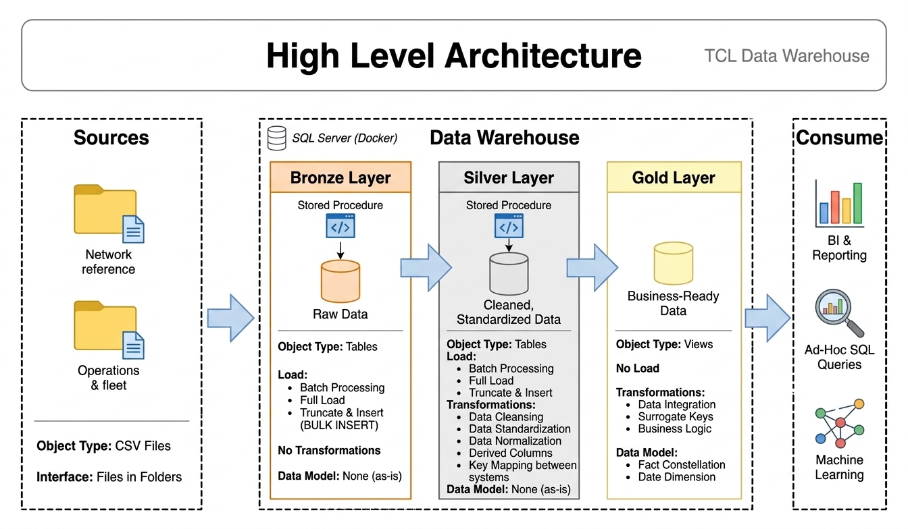
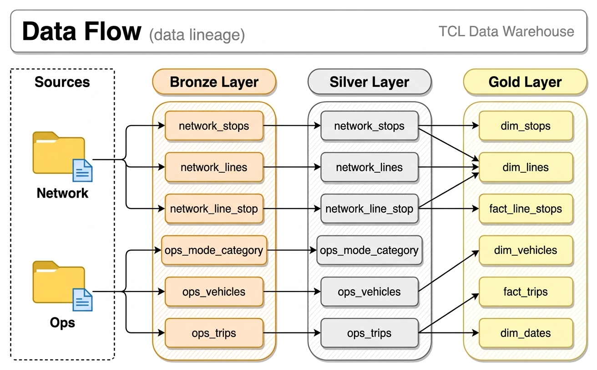

<p align="center">
  
</p>

# TCL Data Warehouse and Analytics Project

A data warehouse built on Lyon's public transport network (TCL) with SQL Server: stops, lines, vehicles and every stop
of every run, extracted from two source systems and turned into insights on punctuality, service reliability and
ridership. Designed as a portfolio project.

## Data Architecture

The warehouse follows the **Medallion Architecture**, with one schema per layer in the `TclDataWarehouse` database:



1. **Bronze**: raw data loaded as-is from the CSV files with `BULK INSERT` (`bronze.load_bronze`).
2. **Silver**: cleansed, standardized and normalized data, with data quality issues resolved and the keys of the two
   source systems made joinable (`silver.load_silver`).
3. **Gold**: business-ready views modeled into a **fact constellation**: two fact tables sharing the same dimensions,
   for reporting and analytics.

### Data Flow

Each source file goes through bronze and silver before feeding the gold views:



### Data Model

`fact_trips` links to the four dimensions; `fact_line_stops` shares `dim_lines` and `dim_stops` with it. Every view
and column is described in the [data catalog](docs/data_catalog.md).


## Project Overview

1. **Data Architecture**: design a modern data warehouse with Bronze, Silver and Gold layers.
2. **ETL Pipelines**: extract, transform and load the source files into the warehouse.
3. **Data Modeling**: build fact and dimension tables optimized for analytical queries.
4. **Analytics & Reporting**: write SQL-based reports on the network's performance.

## Dataset

Six CSV files from two source systems, each with its own conventions:

| System | File | One row = |
|---|---|---|
| Network reference (`data/source_network/`) | `stop.csv` | one stop record (a platform) |
| | `line.csv` | one version of a line in one direction |
| | `line_stop.csv` | one stop of a line in one direction, with its position |
| Operations & fleet (`data/source_ops/`) | `mode_category.csv` | one combination of transport mode and line category |
| | `vehicle.csv` | one version of a vehicle record |
| | `trip.csv` | one run stopping at one stop on one service day |

Columns, statuses and relations are described in [data/README.md](data/README.md).
The CSV files are not versioned: place them in `data/source_network/` and `data/source_ops/` before loading.

## Getting Started

1. Copy `env.example` to `.env` and set a strong SA password (at least 8 characters, with 3 of: uppercase,
   lowercase, digit, symbol).
2. Start SQL Server and wait until the container is `healthy`:
   ```bash
   docker compose up -d
   docker compose ps
   ```
3. Connect to `localhost,1433` with the login `sa` and the password from `.env` (trust the server certificate),
   for example from VS Code with the SQL Server (mssql) extension.
4. Run the scripts in this order:

   | Step | Run | Does |
   |---|---|---|
   | 1 | `scripts/init_database.sql` | creates the database and the `bronze`, `silver` and `gold` schemas (drops `TclDataWarehouse` if it exists) |
   | 2 | `scripts/bronze/ddl_bronze.sql`, `scripts/bronze/proc_load_bronze.sql` | creates the bronze tables and their load procedure |
   | 3 | `EXEC bronze.load_bronze;` | loads the CSV files |
   | 4 | `scripts/silver/ddl_silver.sql`, `scripts/silver/proc_load_silver.sql` | creates the silver tables and their cleaning procedure |
   | 5 | `EXEC silver.load_silver;` | cleans bronze into silver |
   | 6 | `scripts/gold/ddl_gold.sql` | creates the gold views |
   | 7 | `tests/quality_checks_silver.sql`, `tests/quality_checks_gold.sql` | quality checks: each one says what result to expect |

   Without VS Code, a script can be run inside the container:
   ```bash
   docker compose cp scripts/init_database.sql sqlserver:/tmp/script.sql
   docker compose exec sqlserver sh -c '/opt/mssql-tools18/bin/sqlcmd -S localhost -U sa -P "$MSSQL_SA_PASSWORD" -C -b -i /tmp/script.sql'
   ```

## Project Requirements

### Data Engineering

Build a SQL Server data warehouse that consolidates the TCL network's data for analytical reporting.

- **Data Sources**: the six CSV files of the two source systems.
- **Data Quality**: cleanse and resolve data quality issues before analysis.
- **Integration**: combine both systems into a single data model designed for analytical queries.
- **Scope**: one month of service; historization of the reference data is not required (gold keeps the current
  version of lines and vehicles).
- **Documentation**: document the data model for business and analytics teams.

### Analytics & Reporting

Develop SQL-based analytics on:

- **Punctuality**: actual vs planned times by line, mode, stop and time of day.
- **Service Reliability**: cancelled runs and skipped stops by line, mode and day.
- **Ridership**: boardings and alightings by line, stop and hour.
- **Fleet Usage**: vehicle use and load compared with capacity.

## Repository Structure

```
tcl-data-warehouse/
├── data/                       # Source CSV files (not versioned) and their documentation
│   ├── source_network/         # Network reference system: stop, line, line_stop
│   ├── source_ops/             # Operations & fleet system: mode_category, vehicle, trip
│   └── README.md
├── docs/
│   ├── data_architecture.jpeg  # High-level architecture
│   ├── data_catalog.md         # Gold layer: views, columns and their meaning
│   ├── data_flow.jpeg          # Data lineage: sources -> bronze -> silver -> gold
│   ├── data_model.webp         # Gold layer data model
│   └── tcl.png
├── scripts/
│   ├── init_database.sql       # Creates the database (UTF-8) and the bronze, silver and gold schemas
│   ├── bronze/                 # Bronze tables and their load procedure
│   ├── silver/                 # Silver tables and their cleaning procedure
│   └── gold/                   # Gold views (fact constellation)
├── tests/                      # Quality checks of the silver and gold layers
├── docker-compose.yml          # SQL Server 2022 container
├── env.example                 # Template for the local .env file
└── README.md
```

## About

Independent learning project, not affiliated with TCL or SYTRAL Mobilités.
