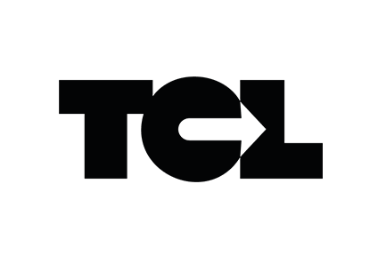

<p align="center">
  
</p>

# TCL Data Warehouse and Analytics Project

A data warehouse built on Lyon's public transport network (TCL) with SQL Server: stops, lines, vehicles and more than
12 million stop events over one month, turned into insights on punctuality, service reliability and ridership.
Designed as a portfolio project.

## Data Architecture

The warehouse follows the **Medallion Architecture**, with one schema per layer in the `TclDataWarehouse` database:

1. **Bronze**: raw data loaded as-is from the CSV files with `BULK INSERT`.
2. **Silver**: cleansed, standardized and normalized data, with data quality issues resolved.
3. **Gold**: business-ready data modeled into a **star schema** for reporting and analytics.

## Project Overview

1. **Data Architecture**: design a modern data warehouse with Bronze, Silver and Gold layers.
2. **ETL Pipelines**: extract, transform and load the source files into the warehouse.
3. **Data Modeling**: build fact and dimension tables optimized for analytical queries.
4. **Analytics & Reporting**: write SQL-based reports on the network's performance.

## Dataset

Five CSV files describe the TCL network from **2026-09-06 to 2026-10-05**:

| File | One row = | Rows |
|---|---|---:|
| `stop.csv` | one platform (boarding point) | 9,788 |
| `line.csv` | one line in one direction | 1,586 |
| `line_stop.csv` | one stop of a line, with its position | 21,629 |
| `vehicle.csv` | one vehicle | 2,038 |
| `trip.csv` | one run stopping at one stop on one day | 12,138,673 |

Columns, statuses and relations are described in [data/README.md](data/README.md).
The CSV files are not versioned: place them in `data/` before loading.

## Getting Started

1. Copy `env.example` to `.env` and set a strong SA password (at least 8 characters, with 3 of: uppercase,
   lowercase, digit, symbol).
2. Start SQL Server and wait until the container is `healthy`:
   ```bash
   docker compose up -d
   docker compose ps
   ```
3. Create the database and its schemas (this drops `TclDataWarehouse` if it exists):
   ```bash
   docker compose cp scripts/init_database.sql sqlserver:/tmp/init_database.sql
   docker compose exec sqlserver sh -c '/opt/mssql-tools18/bin/sqlcmd -S localhost -U sa -P "$MSSQL_SA_PASSWORD" -C -b -i /tmp/init_database.sql'
   ```
4. Connect to `localhost,1433` with the login `sa` and the password from `.env` (trust the server certificate).

## Project Requirements

### Data Engineering

Build a SQL Server data warehouse that consolidates the TCL network's data for analytical reporting.

- **Data Sources**: the five CSV files above.
- **Data Quality**: cleanse and resolve data quality issues before analysis.
- **Integration**: combine all files into a single star schema designed for analytical queries.
- **Scope**: one month of service; historization of the reference data is not required.
- **Documentation**: document the data model for business and analytics teams.

### Analytics & Reporting

Develop SQL-based analytics on:

- **Punctuality**: actual vs planned times by line, mode, stop and time of day.
- **Service Reliability**: cancelled runs and skipped stops, and their reasons.
- **Ridership**: boardings and alightings by line, stop and hour.
- **Fleet Usage**: vehicle use and load compared with capacity.

## Repository Structure

```
tcl-data-warehouse/
├── data/                   # Source CSV files (not versioned) and their documentation
├── docs/                   # Project documentation and diagrams
├── scripts/
│   └── init_database.sql   # Creates the database and the bronze, silver and gold schemas
├── docker-compose.yml      # SQL Server 2022 container
├── env.example             # Template for the local .env file
└── README.md
```

## About

Independent learning project, not affiliated with TCL or SYTRAL Mobilités.
