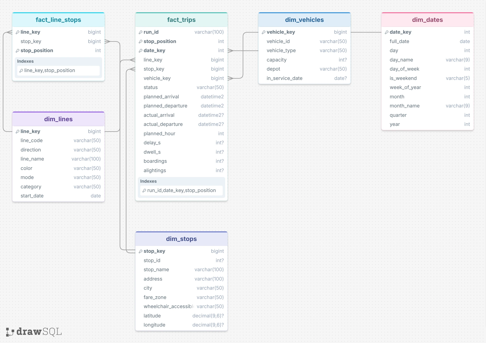

# Data Catalog for Gold Layer

## Overview

The Gold Layer is the business-level data representation, structured to support analytical and reporting use cases.
It is a **fact constellation**: two fact tables share the same dimensions, so their keys can be combined.

`fact_trips` links to the four dimensions; `fact_line_stops` shares `dim_lines` and `dim_stops` with it. The keys
shown in each table are its grain (what one row means); in the warehouse the tables are views, and the quality
checks (`tests/quality_checks_gold.sql`) verify these keys and relationships.

Conventions:
- **Surrogate keys** (`*_key`) are generated in the views and link the facts to the dimensions.
- **Key 0** in `dim_stops` and `dim_vehicles` is the `n/a` member: a trip whose stop was not recorded, or that has no
  known vehicle, points to it instead of having no key.
- **Current version only**: lines and vehicles that changed over time (renamed, rerouted, moved to another depot,
  refitted) appear with their current attributes.
- `n/a` means unknown.

---

## 1. gold.dim_dates

- **Purpose:** Calendar of the years covered by the trips, one row per day, to analyse by day, week, month or year.
- **Columns:**

| Column Name | Data Type | Description |
|---|---|---|
| date_key | INT | Surrogate key of the day in the form yyyymmdd (e.g., 20260908). |
| full_date | DATE | The calendar date (e.g., 2026-09-08). |
| day | INT | Day of the month, 1 to 31. |
| day_name | VARCHAR(9) | Name of the day (e.g., 'Tuesday'). |
| day_of_week | INT | Day of the week, from 1 = Monday to 7 = Sunday. |
| is_weekend | VARCHAR(5) | 'true' on Saturdays and Sundays, 'false' otherwise. |
| week_of_year | INT | ISO week number, 1 to 53 (e.g., 37). |
| month | INT | Month number, 1 to 12. |
| month_name | VARCHAR(9) | Name of the month (e.g., 'September'). |
| quarter | INT | Quarter of the year, 1 to 4. |
| year | INT | Calendar year (e.g., 2026). |

## 2. gold.dim_lines

- **Purpose:** The lines of the network in each direction, with their transport mode and category.
- **Columns:**

| Column Name | Data Type | Description |
|---|---|---|
| line_key | BIGINT | Surrogate key uniquely identifying a line in one direction. |
| line_code | VARCHAR(50) | Public code of the line, as shown to passengers (e.g., 'A', 'C1', 'JD346'). |
| direction | VARCHAR(50) | Direction of travel: 'Outbound' or 'Return'. |
| line_name | VARCHAR(100) | Name of the line, made of its termini (e.g., 'Perrache - Vaulx-en-Velin La Soie'). |
| color | VARCHAR(50) | Colour of the line on maps, as a hexadecimal RGB code (e.g., 'E8308A'). |
| mode | VARCHAR(50) | Transport mode: 'Metro', 'Tram', 'Trolleybus', 'Bus', 'Funicular' or 'River shuttle'. |
| category | VARCHAR(50) | Kind of service (e.g., 'Regular', 'School', 'Event', 'On-demand', 'Metro replacement'). |
| start_date | DATE | Date the current version of the line came into force. |

## 3. gold.dim_stops

- **Purpose:** The stops of the network (one row per platform, or boarding point), with their location and accessibility.
- **Columns:**

| Column Name | Data Type | Description |
|---|---|---|
| stop_key | BIGINT | Surrogate key uniquely identifying a stop; 0 = unknown stop. |
| stop_id | INT | Identifier of the stop in the network's timetable (e.g., 12265). |
| stop_name | VARCHAR(100) | Name of the stop as shown to passengers (e.g., 'Gare de Vaise-G.Collomb'). |
| address | VARCHAR(100) | Street address of the stop; 'n/a' when not published. |
| city | VARCHAR(50) | Commune of the stop (e.g., 'Lyon 9e Arrondissement', 'Villeurbanne'); 'n/a' when not published. |
| fare_zone | VARCHAR(50) | Fare zone: 'Zone 1' to 'Zone 5', or 'Zone Externe' outside the zoned network. |
| wheelchair_accessible | VARCHAR(50) | Whether the stop is wheelchair accessible: 'true', 'false' or 'n/a' (unknown). |
| latitude | DECIMAL(9,6) | Latitude of the stop, WGS 84 (e.g., 45.780795). |
| longitude | DECIMAL(9,6) | Longitude of the stop, WGS 84 (e.g., 4.804658). |

## 4. gold.dim_vehicles

- **Purpose:** The fleet: every vehicle that can run on the network, with its type, capacity and depot.
- **Columns:**

| Column Name | Data Type | Description |
|---|---|---|
| vehicle_key | BIGINT | Surrogate key uniquely identifying a vehicle; 0 = no vehicle or vehicle not in the fleet. |
| vehicle_id | VARCHAR(50) | Fleet number of the vehicle (e.g., '102', 'E157005'). |
| vehicle_type | VARCHAR(50) | Type of vehicle: 'Metro', 'Tram', 'Trolleybus', 'Bus', 'Funicular' or 'River shuttle'. |
| capacity | INT | Number of passengers the vehicle can carry (e.g., 200). |
| depot | VARCHAR(50) | Depot the vehicle is attached to (e.g., 'MEYZIEU'). |
| in_service_date | DATE | Date the vehicle first entered service; NULL when unknown. |

## 5. gold.fact_trips

- **Purpose:** What actually happened on the network: one row per run stopping (or planned to stop) at one stop on one
  service day, with the planned and actual times, the delay and the passenger counts.
- **Columns:**

| Column Name | Data Type | Description |
|---|---|---|
| run_id | VARCHAR(100) | Identifier of the scheduled run, repeated on every day it operates. |
| stop_position | INT | Position of the stop in the run, from 1 = first stop to n = terminus. |
| date_key | INT | Surrogate key linking to the service day in `dim_dates`. A run after midnight belongs to the previous service day. |
| line_key | BIGINT | Surrogate key linking to the line and direction in `dim_lines`. |
| stop_key | BIGINT | Surrogate key linking to the stop in `dim_stops`. |
| vehicle_key | BIGINT | Surrogate key linking to the vehicle in `dim_vehicles`; 0 when there is no known vehicle (cancelled run, or vehicle not in the fleet). |
| status | VARCHAR(50) | 'OPERATED': the run stopped here · 'CANCELLED': the whole run did not run · 'SKIPPED': the run did not serve this stop. |
| planned_arrival | DATETIME2(0) | Arrival time in the timetable (e.g., 2026-09-08 07:38:00). |
| planned_departure | DATETIME2(0) | Departure time in the timetable. |
| actual_arrival | DATETIME2(0) | Arrival time recorded on board; NULL when the stop was not served. |
| actual_departure | DATETIME2(0) | Departure time recorded on board; NULL when the stop was not served. |
| planned_hour | INT | Hour of the planned arrival, 0 to 23, to compare peak and off-peak hours. |
| delay_s | INT | Actual minus planned arrival, in seconds; negative when early (e.g., -40). NULL when the stop was not served. |
| dwell_s | INT | Time spent at the stop (actual departure minus actual arrival), in seconds. |
| boardings | INT | Passengers getting on at this stop; NULL when the vehicle has no passenger counter. |
| alightings | INT | Passengers getting off at this stop; NULL when the vehicle has no passenger counter. |

## 6. gold.fact_line_stops

- **Purpose:** The route of each line: which stops it serves, in which order, in each direction. It has no measures
  and no dates.
- **Columns:**

| Column Name | Data Type | Description |
|---|---|---|
| line_key | BIGINT | Surrogate key linking to the line and direction in `dim_lines`. |
| stop_key | BIGINT | Surrogate key linking to the stop in `dim_stops`. |
| stop_position | INT | Position of the stop on the line, from 1 = first stop to n = terminus. |
